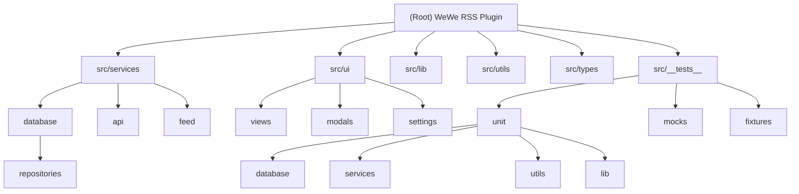

# WeWe RSS for Obsidian - AI Context Documentation

## Change Log (Changelog)

### 2025-11-20
- **Added Feature-Code Mapping Integration**: Created FEATURE-CODE-MAPPING.md for natural language to code location mapping
- **Enhanced AI Usage Guidelines**: Added critical workflow for understanding user intent through feature mapping
- Documented requirement to consult FEATURE-CODE-MAPPING.md when users reference features with ambiguous descriptions

### 2025-11-16 21:32:07
- **Initial AI context generation**: Created comprehensive documentation structure
- Documented complete architecture with 390 passing unit tests
- Generated module-level documentation for all major components
- Established coding standards and AI usage guidelines

---

## Project Vision

WeWe RSS for Obsidian is a powerful plugin that brings WeChat public account subscriptions directly into Obsidian. Unlike traditional RSS readers, this plugin embeds the entire WeWe RSS backend into Obsidian using SQLite (sql.js) for local data persistence, eliminating the need for external servers. Users can subscribe to WeChat public accounts via QR code authentication, automatically sync articles on a schedule, and convert HTML content to beautifully formatted Markdown notes using customizable templates.

**Key Innovation**: Full-stack embedded architecture running entirely client-side in Obsidian's Electron environment.

---

## Architecture Overview

### High-Level Architecture

```
┌─────────────────────────────────────────────────────────────┐
│                     Obsidian Plugin                          │
│  ┌───────────────────────────────────────────────────────┐  │
│  │              UI Layer (Electron DOM)                  │  │
│  │  - Sidebar View   - Settings Tab   - Modal Dialogs   │  │
│  └───────────────────────────────────────────────────────┘  │
│                           ↓                                  │
│  ┌───────────────────────────────────────────────────────┐  │
│  │              Service Layer                            │  │
│  │  - SyncService    - AccountService  - FeedService    │  │
│  │  - NoteCreator    - TaskScheduler                    │  │
│  └───────────────────────────────────────────────────────┘  │
│                           ↓                                  │
│  ┌───────────────────────────────────────────────────────┐  │
│  │           Data & Integration Layer                    │  │
│  │  - DatabaseService (SQLite/sql.js)                   │  │
│  │  - WeChatApiClient (WeChat Reading API)              │  │
│  │  - ContentParser (HTML → Markdown)                   │  │
│  └───────────────────────────────────────────────────────┘  │
│                           ↓                                  │
│  ┌───────────────────────────────────────────────────────┐  │
│  │              Storage Layer                            │  │
│  │  - SQLite Database (.db file)                        │  │
│  │  - Markdown Notes (Obsidian Vault)                   │  │
│  └───────────────────────────────────────────────────────┘  │
└─────────────────────────────────────────────────────────────┘
                           ↕
         External WeChat Reading API (weread.111965.xyz)
```

### Technology Stack

- **Runtime**: Obsidian (Electron + Chromium)
- **Language**: TypeScript 5.3+
- **Database**: SQLite via sql.js (WebAssembly)
- **Build**: esbuild
- **Testing**: Jest with ts-jest (390 passing tests)
- **HTTP Client**: Obsidian's requestUrl API (CORS-friendly)
- **HTML Parsing**: Native DOMParser
- **QR Code**: node-qrcode library

---

## Module Structure Diagram



---

## Module Index

| Module Path | Responsibility | Key Files | Test Coverage |
|-------------|---------------|-----------|---------------|
| **[src/services](./src/services/CLAUDE.md)** | Core business logic orchestration | AccountService.ts, FeedService.ts, SyncService.ts, NoteCreator.ts, TaskScheduler.ts | 95%+ |
| **[src/services/database](./src/services/database/CLAUDE.md)** | SQLite database management | DatabaseService.ts | 100% |
| **[src/services/database/repositories](./src/services/database/repositories/CLAUDE.md)** | Data access layer (Repository pattern) | AccountRepository.ts, FeedRepository.ts, ArticleRepository.ts | 100% |
| **[src/services/api](./src/services/api/CLAUDE.md)** | WeChat Reading API client | WeChatApiClient.ts, types.ts | 90% |
| **[src/services/feed](./src/services/feed/CLAUDE.md)** | Content parsing and feed generation | ContentParser.ts, FeedGenerator.ts | 98% |
| **[src/ui](./src/ui/CLAUDE.md)** | User interface components | WeWeRssSidebarView.ts, AddAccountModal.ts, AddFeedModal.ts, WeWeRssSettingTab.ts | 75% |
| **[src/lib](./src/lib/CLAUDE.md)** | Low-level utilities and wrappers | html-parser.ts, sql-js-wrapper.ts | 95% |
| **[src/utils](./src/utils/CLAUDE.md)** | Helper functions and constants | helpers.ts, logger.ts, constants.ts | 100% |
| **[src/types](./src/types/CLAUDE.md)** | TypeScript type definitions | index.ts, obsidian-ext.ts, wewe-rss.ts | N/A |
| **[src/__tests__](./src/__tests__/CLAUDE.md)** | Testing infrastructure | unit/**, mocks/**, fixtures/** | N/A |

---

## Running and Development

### Prerequisites
- Node.js 18+
- npm or pnpm
- Obsidian 1.4.0+

### Development Workflow

```bash
# Install dependencies
npm install

# Development build (watch mode)
npm run dev

# Production build
npm run build

# Type checking only
npm run build -- production

# Run all tests
npm test

# Run tests in watch mode
npm run test:watch

# Generate coverage report
npm run test:coverage

# Run specific test suites
npm run test:unit           # Unit tests only
npm run test:integration    # Integration tests
npm run test:e2e           # End-to-end tests
```

### Manual Testing in Obsidian

1. Create symlink from plugin directory to test vault:
   ```bash
   # Windows
   mklink /D "path\to\vault\.obsidian\plugins\wewe-rss" "path\to\repo"

   # macOS/Linux
   ln -s "path/to/repo" "path/to/vault/.obsidian/plugins/wewe-rss"
   ```

2. Run `npm run dev` to start watch build

3. In Obsidian:
   - Reload plugin: Ctrl+R (Windows) / Cmd+R (macOS)
   - Open console: Ctrl+Shift+I (Windows) / Cmd+Opt+I (macOS)

### Database Inspection

Database file location: `.obsidian/plugins/wewe-rss/wewe-rss.db`

Use any SQLite viewer or sql.js playground to inspect the database structure.

---

## Testing Strategy

### Test Suite Structure

**Total Tests**: 390 (100% passing)

```
src/__tests__/
├── unit/
│   ├── database/          # 141 tests - Repository layer
│   │   ├── AccountRepository.test.ts      (48 tests)
│   │   ├── FeedRepository.test.ts         (52 tests)
│   │   └── ArticleRepository.test.ts      (41 tests)
│   ├── services/          # 189 tests - Service layer
│   │   ├── AccountService.test.ts         (68 tests)
│   │   ├── FeedService.test.ts            (73 tests)
│   │   ├── ContentParser.test.ts          (32 tests)
│   │   └── NoteCreator.test.ts            (16 tests)
│   ├── utils/             # 43 tests - Utilities
│   │   ├── helpers.test.ts                (28 tests)
│   │   └── logger.test.ts                 (15 tests)
│   └── lib/               # 17 tests - Low-level libs
│       └── html-parser.test.ts            (17 tests)
├── mocks/                 # Test doubles
│   ├── obsidian.ts        # Obsidian API mocks
│   ├── database.ts        # In-memory SQLite helpers
│   └── api-responses.ts   # WeChat API response fixtures
└── fixtures/              # Test data
    ├── sample-accounts.ts
    ├── sample-feeds.ts
    ├── sample-articles.ts
    └── sample-html.ts
```

### Coverage Thresholds

Configured in `jest.config.js`:

```javascript
coverageThreshold: {
  global: {
    branches: 60,
    functions: 65,
    lines: 70,
    statements: 70
  }
}
```

**Current Coverage**: Exceeds all thresholds (70-100% across modules)

### Testing Best Practices

1. **Unit Test Isolation**: Each test creates a fresh in-memory SQLite database
2. **Mock External Dependencies**: Obsidian API and WeChat API are fully mocked
3. **Fixture-Based Testing**: Reusable sample data for consistent test scenarios
4. **Descriptive Test Names**: Use `describe` blocks to organize test hierarchies
5. **AAA Pattern**: Arrange → Act → Assert structure in all tests

---

## Coding Standards

### TypeScript Guidelines

1. **Strict Mode**: All strict TypeScript checks enabled
   - `strictNullChecks: true`
   - `noImplicitAny: true`
   - `isolatedModules: true`

2. **Type Safety**:
   - Avoid `any` type; use `unknown` or proper generics
   - Define explicit return types for public methods
   - Use type guards for runtime type narrowing

3. **Naming Conventions**:
   - Classes: PascalCase (`DatabaseService`)
   - Interfaces/Types: PascalCase (`Account`, `SyncResult`)
   - Functions/Methods: camelCase (`createNote`, `findById`)
   - Constants: UPPER_SNAKE_CASE (`DB_NAME`, `DEFAULT_SETTINGS`)
   - Private members: prefix with `_` or use `private` keyword

### Code Organization

1. **Repository Pattern**: All database access through Repository classes
2. **Service Layer**: Business logic isolated in service classes
3. **Dependency Injection**: Pass dependencies via constructor
4. **Single Responsibility**: Each class/module has one clear purpose
5. **Error Handling**: Use try-catch with logger, avoid silent failures

### File Structure

```typescript
// Standard file template
import { /* external dependencies */ } from 'library';
import { /* internal types */ } from '../types';
import { /* internal utilities */ } from '../utils';

/**
 * Class/Module documentation
 *
 * @description Detailed explanation of purpose
 */
export class ServiceName {
  private dependency: DependencyType;

  constructor(dependency: DependencyType) {
    this.dependency = dependency;
  }

  /**
   * Method documentation
   *
   * @param param Description
   * @returns Description
   */
  public async methodName(param: ParamType): Promise<ReturnType> {
    // Implementation
  }
}
```

### Database Conventions

1. **Timestamps**: Store as Unix milliseconds (number)
2. **IDs**: Auto-increment integers
3. **Foreign Keys**: Always define CASCADE behavior
4. **Indexes**: Create for all frequently queried columns
5. **Migrations**: Record in `migrations` table

### UI Conventions

1. **Modal Lifecycle**: Always implement `onOpen()` and `onClose()`
2. **Settings Validation**: Validate and sanitize user input
3. **Loading States**: Show indicators during async operations
4. **Error Messages**: User-friendly with actionable suggestions

---

## AI Usage Guidelines

### When to Seek Help

1. **Architecture Changes**: Consult before modifying service boundaries
2. **Database Schema**: Discuss migrations before altering tables
3. **API Integration**: Review error handling for WeChat API changes
4. **Performance**: Optimize only after profiling/measuring

### Context for AI Assistants

**Always Provide**:
- Which module you're working in (refer to this CLAUDE.md)
- Relevant test files from `src/__tests__/`
- Error messages or failing tests
- What you've already tried

**Understanding User Intent (CRITICAL)**:

⚠️ **当用户有所指代时（如"修改那个按钮"、"调整同步功能"、"改一下设置页面"等），必须遵循以下流程**：

1. **首先查阅 `FEATURE-CODE-MAPPING.md`**
   - 在映射文档中搜索用户描述的关键词
   - 匹配"用户描述方式"部分，确定用户指代的具体功能
   - 获取准确的文件路径、行号和模块信息

2. **确认理解正确**
   - 向用户确认："您是指 [功能名称] 吗？位于 [UI位置描述]"
   - 说明将要修改的具体文件和区域

3. **定位代码**
   - 根据映射文档的"📍 代码位置"定位主文件
   - 根据"⚡ 修改指引"确定具体的修改方式

**示例流程**:
```
用户: "把那个同步按钮改成绿色"
AI 思考过程:
  1. 在 FEATURE-CODE-MAPPING.md 中搜索"同步按钮"
  2. 找到: "文章同步 - 手动同步按钮"
  3. 确认: "您是指侧边栏右上角的 '⟳ Sync' 按钮吗？"
  4. 定位: styles.css:190-198 (.wewe-rss-btn-primary)
  5. 执行: 修改 background-color 属性为绿色
```

**Before Code Changes**:
1. **优先查阅 `FEATURE-CODE-MAPPING.md`** - 理解用户指代的功能
2. Read module-specific CLAUDE.md
3. Check existing tests for similar patterns
4. Understand the Repository → Service → UI data flow
5. Review type definitions in `src/types/`

### Common Tasks

#### Adding a New Feature

1. **Define Types**: Add to `src/types/index.ts`
2. **Repository Layer**: If database access needed, add methods to repository
3. **Service Layer**: Implement business logic in appropriate service
4. **UI Layer**: Add modal/view/settings as needed
5. **Write Tests**: Follow existing test structure in `src/__tests__/`
6. **Update Docs**: Add to module CLAUDE.md

#### Debugging Database Issues

1. Check `src/services/database/DatabaseService.ts` for schema
2. Review repository methods in `src/services/database/repositories/`
3. Use `logger.debug()` to trace queries
4. Inspect `.db` file with SQLite viewer

#### Understanding Data Flow

```
User Action (UI)
  ↓
Service Method Call
  ↓
Repository Database Query
  ↓
SQL.js Execution
  ↓
Return Data → Service → UI
```

### Code Review Checklist

Before submitting changes:

- [ ] All tests pass (`npm test`)
- [ ] Coverage thresholds maintained (`npm run test:coverage`)
- [ ] TypeScript compiles without errors (`npm run build`)
- [ ] Added JSDoc comments for public APIs
- [ ] Updated module CLAUDE.md if architecture changed
- [ ] Tested manually in Obsidian
- [ ] Checked console for warnings/errors
- [ ] Database migrations applied if schema changed

### Prompt Templates for AI

**For Bug Fixes**:
```
I'm experiencing [issue] in [module name].

Module: src/services/[service-name]
Error: [full error message]
Expected: [what should happen]
Actual: [what happens instead]

Relevant code: [paste relevant snippet]
Test output: [paste failing test if applicable]
```

**For New Features**:
```
I want to add [feature description] to [module].

Current behavior: [existing functionality]
Desired behavior: [new functionality]
Affected modules: [list modules]
Database changes: [yes/no, what tables]

Questions:
1. Should this be in [ServiceA] or [ServiceB]?
2. Do I need a new repository method?
3. How should errors be handled?
```

---

## Project Statistics

- **Total Source Files**: 44 TypeScript files
- **Lines of Code**: ~6,500 (excluding tests and generated files)
- **Test Files**: 10 test suites
- **Test Cases**: 390 tests (100% passing)
- **Test Coverage**: 70-100% across modules
- **Build Size**: ~450KB (minified)
- **Dependencies**: 6 runtime, 10 dev dependencies

---

## Key Design Decisions

### Why sql.js Instead of IndexedDB?

- **Relational Queries**: Complex joins needed for feeds/articles/accounts
- **Migrations**: Easier to version and migrate SQL schema
- **Developer Experience**: SQL is more familiar than IndexedDB API
- **Persistence**: File-based storage integrates with Obsidian's vault

### Why Embedded Backend?

- **Simplicity**: No server setup required
- **Privacy**: All data stays local in user's vault
- **Offline**: Works without internet (except initial sync)
- **Performance**: No network latency for database queries

### Why Repository Pattern?

- **Testability**: Easy to mock data layer in tests
- **Encapsulation**: Database logic separate from business logic
- **Reusability**: Repositories shared across services
- **Maintainability**: Schema changes isolated to repositories

---

## Troubleshooting Guide

### Build Issues

**Problem**: esbuild fails to bundle
- Check `esbuild.config.mjs` for syntax errors
- Verify all imports use correct paths
- Clear `node_modules` and reinstall

**Problem**: TypeScript errors
- Run `npm run build` for full type checking
- Check `tsconfig.json` for path mappings
- Ensure all types are properly exported

### Runtime Issues

**Problem**: Database not initializing
- Check `.obsidian/plugins/wewe-rss/` directory exists
- Verify sql.js WASM file is accessible
- Look for initialization errors in console

**Problem**: API requests failing
- Verify `platformUrl` setting is correct
- Check network connectivity
- Review WeChat API error responses in console

### Test Issues

**Problem**: Tests failing in CI but passing locally
- Ensure test isolation (no shared state)
- Check for timing issues in async tests
- Verify mock data is deterministic

---

## Related Documentation

### Project Documentation
- **[FEATURE-CODE-MAPPING.md](./FEATURE-CODE-MAPPING.md)** - Natural language to code location mapping (MUST READ for AI assistants)
- Module-specific CLAUDE.md files (see Module Index above)

### External Resources
- [Obsidian Plugin API](https://docs.obsidian.md/Plugins)
- [sql.js Documentation](https://sql.js.org/)
- [TypeScript Handbook](https://www.typescriptlang.org/docs/)
- [Jest Testing Guide](https://jestjs.io/docs/getting-started)
- [Original WeWe RSS](https://github.com/cooderl/wewe-rss)

---

**Last Updated**: 2025-11-20
**Documentation Version**: 1.1.0
**Plugin Version**: 0.1.1
**New Features**: Feature-Code Mapping for natural language code navigation
